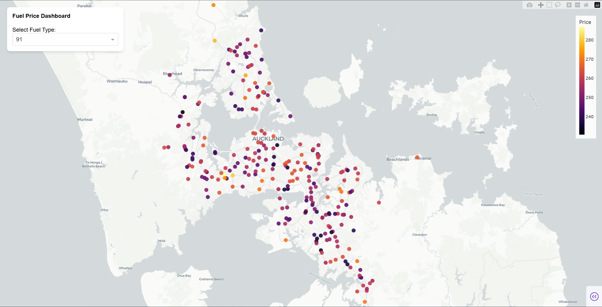
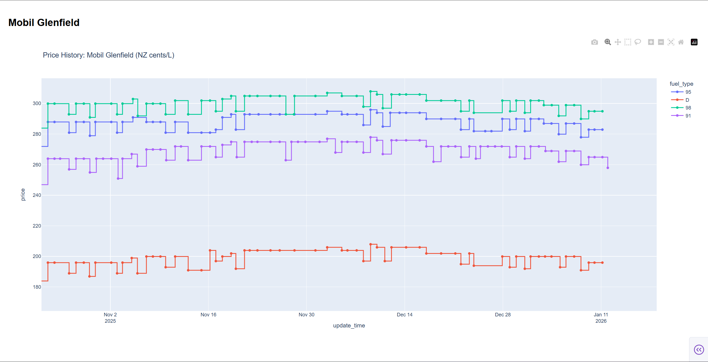

# Web crawler "gaspy"

 Record petrol and diesel fuel prices in major New Zealand cities


## Install

Create a Python virtual environment and activate.

Run the following command.

```
pip install -r requirements-dash.txt
```

Create a PostgreSQL 17 database in [Neon](https://neon.com/) database, or your own PostgreSQL database.

Run `database_schema.sql` in database console to mock the database schema.

Import `stations.csv` into database table `stations` as the initialization. The program will update this table when it gets fuel prices.

Include the following variables into environment variables.

| Variable       | Description                                                  |
| -------------- | ------------------------------------------------------------ |
| NEON_DB        | Connection string to Neon database. If using other database, set to connection string of your own PostgreSQL database. |
| GASPY_EMAIL    | Email of "gaspy" account.                                    |
| GASPY_PASSWORD | Password of "gaspy" account.                                 |


## Usage

This program can get data from "[gaspy](https://gaspy.nz)" and saves to Neon database. 

It records petrol and diesel fuel prices -- drivers physically read from oil pumps in fuel stations and uploaded to gaspy.nz website, in major New Zealand cities.

GitHub Actions update prices of the past day in 6:00 UTC every day.

When you have accumulated data in the database, activate Python virtual environment and run the following command.

```
python dashboard.py
```

Copy the link from output of terminal and visit the link in browser.




